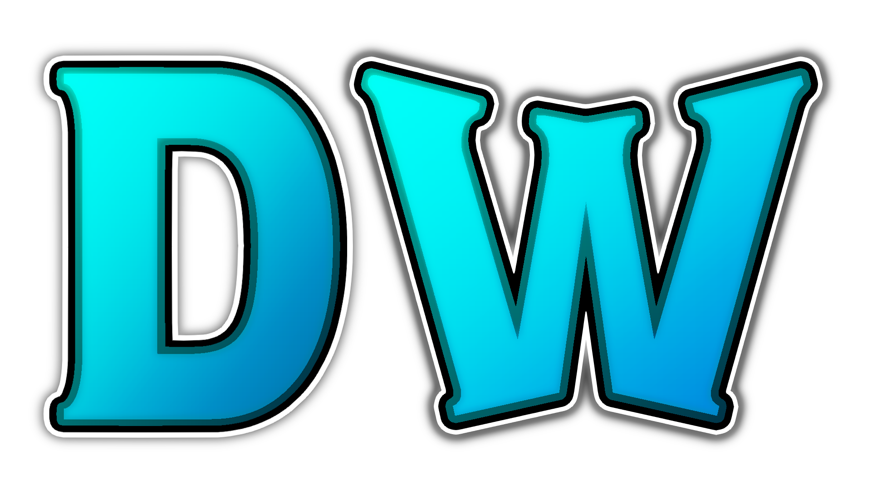

  <h1>DeepWarden</h1>
  
  
  
    
  

## Current list of features
DeepWarden currently lets you automatically:
- Activate Golden Tongue
- Auto uppercut (+ dynamic version to only uppercut while running)
- Buy
- Clear combat tags / mb all
- Drop notes
- Eat
- Feint
- Flash map (hold M open map, release M close map)
- Hold M1 to keep M1ing
- Log/Leave the server
- Movestack Aerial M1 and Air Dash
- Movestack bell with dodge/parry
- Progress agility
- Progress charisma
- Progress fortitude (boulder only)
- Progress willpower
- Ritual cast
- Roll Cancel
- Roll Cancel
- Roll Crit
- Roll M1
- Roll Parry
- Roll cast
- Sell
- Send a discord message (e.g for gank pings, also automatically takes a screenshot)
- Send customizable chat messages
- Slide cast
- Swap motifs
- Trashtalk
- Uppercut assassinate
- Use Ankle Cutter
- Use Mayhem
- Use Relentless Hunt
- Use Rising Star
- Use mantra variants
- Use tacet (can choose to automatically uncrouch after)
